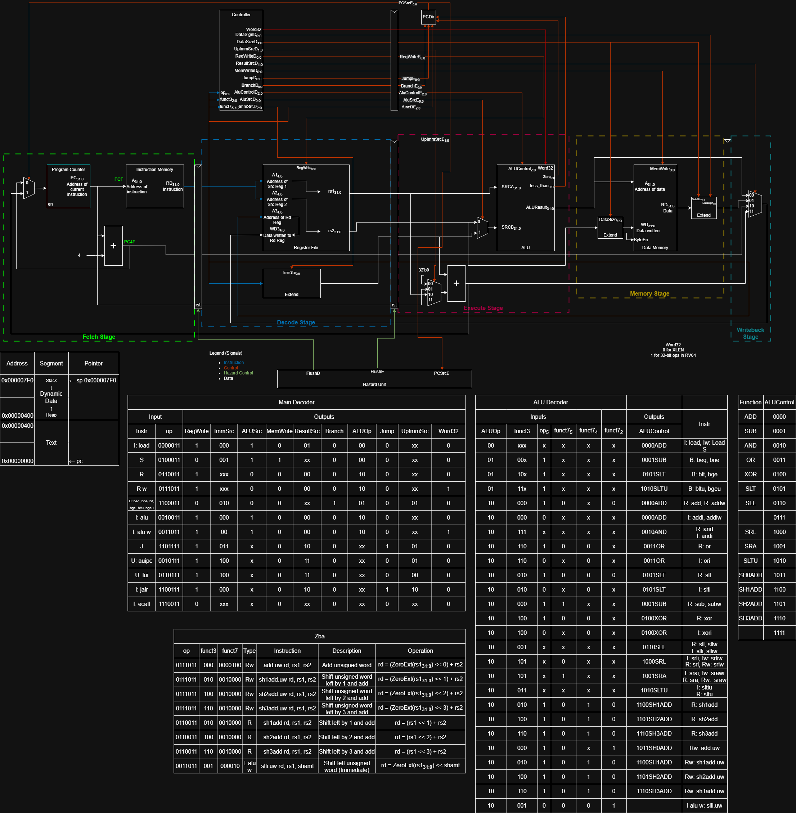

# Configurable Single/Pipelined RISC-V Core Implementation using SystemVerilog (GitHub)
## Features
- Configurable RISC-V core supporting RV32I, RV64I, and RV64I + Zba, with a 3-stage pipelined microarchitecture.
- Self-terminating SystemVerilog testbench with register file and data memory monitors to validate correctness.
- Modern synthesizable SystemVerilog with a clean, scalable RTL suitable for FPGA/ASIC flows.
- Makefile that integrates GNU RISC-V toolchain to compile, assemble, and link C/assembly programs. 
- Custom linker script to control memory layout and section placement with explicit memory origin and size.
- Separate instruction (read-only) and data memories (read/write) initialized by using objcopy to export .text and .data section into their respective .mem files for simulation.
- Automated simulation flow in QuestaSim using DO files wrapped in a single script.
- Verified functionality by running C and assembly test programs, including a CORDIC-based sin/cos implementation, successfully executed on the core.
- Produced complete datapath, controlpath, and hazard unit diagrams using Draw.io for documentation and design review.

```
.
├── hdl/
│   ├── qs_run/                  # QuestaSim working directory
│   ├── rtl/                     # synthesizable RTL/
│   │   ├── rv64i_zba_pipe3_.sv  # Top RTL file of RV64I_Zba
│   │   ├── core/                # Core datapath and control-path
│   │   ├── pipeline_3/          # 3-stage pipeline files
│   │   └── pipeline_5/          # 5-stage pipeline files
│   └── testbench/               # testbench
└── sw                           # Programs used for testing
```

## Diagram of RV64I_Zba


### Notes
- Testbench is still under development
- 5-stage pipeline needs more debugging