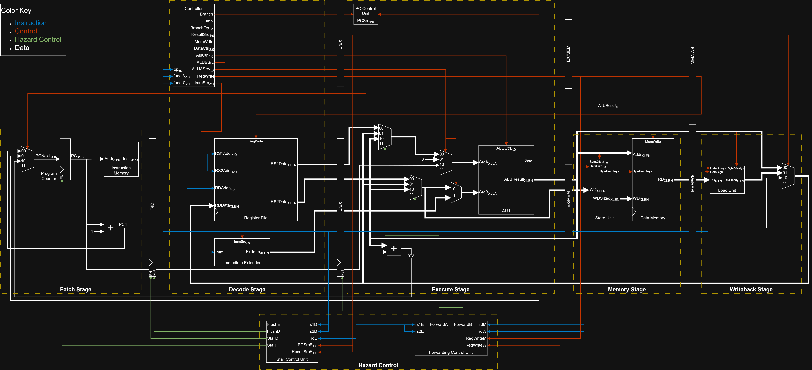

# Configurable Single-Cycle/Pipelined RISC-V Processor

A synthesizable RISC-V processor implementation in SystemVerilog supporting both single-cycle and 5-stage pipelined microarchitectures. This project demonstrates clean SystemVerilog design practices, hybrid verification, and automated build/simulation flows.

**Key Features:**
- 32-bit and 64-bit base integer ISA
- Single-cycle and 5-stage pipelined microarchitectures
- Zba extension support
- Fully synthesizable on Artix-7 FPGA with BRAM-based memories
- RV32I 5-stage pipeline: up to 50 MHz, 3110 LUTs, 5 BRAMs
- SystemVerilog formal verification with assertions
- Automated build and regression testing
- Modified Harvard architecture with separate instruction and data memories

## Table of Contents

- [Project Structure](#project-structure)
- [Architecture](#architecture)
- [Getting Started](#getting-started)
- [Build System](#build-system)
- [Verification](#verification)
- [Memory Layout](#memory-layout)
- [Future Work](#future-work)

## Project Structure

```
riscv/
├── build/                             # Build artifacts and logs
│   ├── logs/                          # Compilation and simulation logs
│   ├── memory/                        # Generated memory hex files
│   ├── sw/                            # Compiled software binaries
│   └── work/                          # QuestaSim work directory
├── docs/                              # Documentation
│   └── diagrams/                      # draw.io diagrams
├── rtl/                               # Hardware design files
│   ├── common/                        # Shared RTL components
│   │   ├── control_path/              # Control logic modules
│   │   ├── data_path/                 # Datapath modules
│   │   ├── memory/                    # Data and instruction memories
│   │   └── utils/                     # Generic primitives
│   ├── cores/                         # Core top-level modules
│   ├── pipeline/                      # Pipeline-specific components
│   └── pkg                            # SystemVerilog packages
└── test/                              # Test infrastructure
    ├── sim/                           # Simulation-specific files
    ├── sw/                            # Test programs and runtime
    │   ├── crt/                       # C runtime (startup/exit)
    │   ├── custom/                    # Custom test programs
    │   ├── headers/                   # Test macros and utilities
    │   ├── linker/                    # Custom linker script
    │   ├── riscv_tests/               # Adapted riscv-tests
    │   │   ├── headers/               # riscv-tests macros and utilities
    │   │   ├── rv32i/                 # 32-bit base integer tests
    │   │   ├── rv32zba/               # 32-bit Zba extension tests
    │   │   ├── rv64i/                 # 64-bit base integer tests
    │   │   └── rv64zba/               # 64-bit Zba extension tests
    │   └── scripts/                   # Build and simulation helper scripts
    └── tb/                            # Verification modules
        ├── assertions/                # Formal assertion modules
        └── pkg/                       # Testbench packages
```

## Architecture

### Microarchitecture Overview

<div style="text-align: center;">
    <figure>
        
        <figcaption>Full Datapath and Control-path digram. Built using draw.io.</figcaption>
    </figure>
</div>

The design is configurable to support two microarchitectures:

- **Single-Cycle:** All instructions execute in one clock cycle, for fast simulation-based debugging
- **5-Stage Pipeline:** Divided into Fetch, Decode, Execute, Memory, and Writeback stages

### Pipeline Stages

- **Fetch:** Program counter management and instruction memory access
- **Decode:** Instruction decode, register file reads, immediate extender, and control signal generation
- **Execute:** Forwarding muxes for data hazard resolution, ALU operations, branch/jump target calculation
- **Memory:** Data memory access with byte-enable support and store alignment handling
- **Writeback:** Loaded data alignment handling and register writeback

### Key Components/Signals

**Program Counter:** Controlled by the PCSrc signal, selecting between `PC+4` for sequential execution and `PC+Imm` for branches and jumps.

#### Control Path:

**Controller:** Centralized control unit that generates control signals based on the opcode, funct3, and funct7 fields of the instruction.
**Main Decoder:** Generates high-level control signals such as RegWrite, MemRead, MemWrite, ALUSrc, and PCSrc based on the opcode.
**ALU Decoder:** Generates ALU control signals based on opcode, funct3, and funct7 fields.
**Branch Decoder:** Determines branch type and generates BranchOp control signal for PC Control Unit.
**Memory Control Unit:** Generates byte-enable and sign/zero-extension control signals for load/store instructions.
**PC Control Unit:** Generates the PC source signal to multiplex between sequential (PC+4), jump, and branch targets.

**Control Signals:**
- **DataCtrl:** A packed struct encapsulating byte-enables and sign/zero-extension control signals for load and store operations.
- **BranchOp:** Used by the PC Control Unit along with less-than and zero flags to calculate PCSrc.
- **ALUCtrl:** Determines the ALU operation to perform based on instruction type and function fields.

#### Datapath:

**ALU:**
- **Source A:** Selected by ALUASrc control signal from rs1 (default), 0 (LUI), or PC (AUIPC)
- **Source B:** Selected by ALUBSrc control signal from rs2 (register-register) or immediate (register-immediate)
- Also, used for jal, jalr, and U-type instructions. 

**Load/Store Units:** Handles data coming from and going to memory, sizing and sign/zero-extending based on the instruction type.

#### Memory:

**Instruction Memory:** Read-only, initialized at simulation start from `text_<testname>.mem`. Non-writable by design.

**Data Memory:**
- Read/write, initialized at simulation start from `data_<testname>.mem`.
- Accessed using load/store instructions.

#### Pipeline Hazards:

**Hazard Mitigation:** Using forwarding and stall control to manage pipeline hazards.
- **Forwarding Control Unit:** Generates the forwarding control logic that controls the forwarding muxes in the execute stage.
- **Stall Control Unit:** Generates the stall and flush signals for the program counter and the pipeline registers.

- Forwarding control logic resolves read-after-write data hazards by bypassing results from later stages (memory and writeback) directly into the execute-stage ALU inputs.
- Forwarding muxes in the execute stage support ALU operand bypassing.
- Register file bypass logic enables data to be forwarded to dependent instructions without waiting for writeback.
- Stall control unit inserts pipeline stalls for load-use hazards and for branch/jump instructions when necessary.


Refer to [docs/tables.md](docs/tables.md) for detailed instruction and control signal mappings.

### Design Principles

- **Modified Harvard Architecture:** Physically separate instruction and data memory spaces, 
- **Clean SystemVerilog:** Modern constructs including enums, packed structs, packages, `bind`, `case inside`, and assignment patterns
- **Synthesizable:** Ready for FPGA implementation, though minor adjustments may be required depending synthesis program support for certain SystemVerilog constructs.
- Design rationale based on *Digital Design and Computer Architecture: RISC-V Edition*

### Synthesis

- **FPGA Synthesis:** Fully synthesizable on Artix-7 devices.
- **BRAM Memories:** Uses FPGA BRAM for both instruction and data memory.
- **Timing:** Verified to achieve up to 50 MHz for the RV32I 5-stage pipeline.
- **Resource Usage:** Approximately 3110 LUTs and 5 BRAMs for the RV32I 5-stage implementation.

### Software Runtime

**C Runtime Components:**
- `_start.S`: Initializes global pointer (gp) and stack pointer (sp); handles main function call and exit
- `_exit.S`: Passes exit status to simulator
- `test_header.h`: Test macros for register preservation following RISC-V calling conventions

**Linker Configuration:** `update_offset.py` dynamically configures linker script with program, data, and stack memory sizes

**Template:** `test/sw/custom/` contains C and assembly template files for writing new programs and verification cases.

## Getting Started

### Requirements

- QuestaSim simulator
- RISC-V GNU GCC toolchain
- GNU Make

**Parameters:**
- `XLEN`: ISA width (32 or 64 bits)
- `CORE`: Microarchitecture (SINGLE-cycle or STAGE5-pipeline)
- `EXT`: Optional extensions (Zba currently supported)
- `SIMGUI`: Enable QuestaSim GUI (default: 0 for command-line only)
- `RGRS`: Enable regression mode (suppresses output, disables signal visibility for speed, default: 0)

### Compiling and Running

#### Single file test

1. Place the test program in `test/sw/` or subdirectories. `TEST=<test_name>` path is relative to `test/sw/`.
2. Compile and link the test program, RTL, and verification files, and generate the hex memory files:

```bash
make build TEST=<test_name> XLEN=[32|64] CORE=[SINGLE|STAGE5] [EXT=ZBA] [SIMGUI=1] [RGRS=1]
```

3. Run the simulation:

```bash
make sim TEST=<test_name> XLEN=[32|64] CORE=[SINGLE|STAGE5] [EXT=ZBA] [SIMGUI=1] [RGRS=1]
```

4. You can check `build/results.txt` for returned status code.

**Example:**
```bash
make build TEST=custom/cordic.c XLEN=32 CORE=SINGLE SIMGUI=1
make sim TEST=custom/cordic.c XLEN=32 CORE=SINGLE SIMGUI=1
```

#### Other build and simulation steps

- You can also build and simulate using `run` target, which combines both steps:

```bash
make run TEST=<test_name> XLEN=[32|64] CORE=[SINGLE|STAGE5] [EXT=ZBA] [SIMGUI=1] [RGRS=1]
```

- You can only build the test program without simulating by using `build_cc` target. RGRS and SIMGU flags are ignored in this case since they only affect the simulation step.

```bash
make build_cc TEST=<test_name> XLEN=[32|64] CORE=[SINGLE|STAGE5] [EXT=ZBA]
```

- You can only compile the RTL and verification files using `build_sv` target. TEST, RGRS, and SIMGUI flags are ignored in this case since they only affect the program compilation and simulation step.

```bash
make build_sv XLEN=[32|64] CORE=[SINGLE|STAGE5] [EXT=ZBA]
```

### **`riscv-tests`**

**Important:** This project uses a subset of `riscv-tests` adapted for this project. See [Test Programs](#test-programs) and [test/sw/riscv_tests/README.md](test/sw/riscv_tests/README.md) for details on the modifications and license.

Regression testing for `riscv-tests` is handled via dedicated targets that iterate over test files, while standard build/sim targets operate on a single test.

1. Compile and link the test program, RTL, and verification files, and generate the hex memory files:

```bash
make build_riscv_tests XLEN=[32|64] CORE=[SINGLE|STAGE5] [EXT=ZBA] RGRS=1
```

2. Run the regression testing:

```bash
make sim_riscv_tests XLEN=[32|64] CORE=[SINGLE|STAGE5] [EXT=ZBA] RGRS=1
```

3. Check `build/results.txt` for the results of each test. If the test didn't pass, the failed test number will be listed.

**Example:**
```bash
make build_riscv_tests XLEN=64 CORE=STAGE5 RGRS=1
make sim_riscv_tests XLEN=64 CORE=STAGE5 RGRS=1
```

#### Other build and simulation steps

- You can also build and simulate using `run_riscv_tests` target, which combines both steps:

```bash
make run_riscv_tests XLEN=[32|64] CORE=[SINGLE|STAGE5] [EXT=ZBA] RGRS=1
```

- You can only build the test program without simulating by using `build_cc` target. RGRS flag is ignored in this case since it only affect the simulation step.

```bash
make build_cc_riscv_tests XLEN=[32|64] CORE=[SINGLE|STAGE5] [EXT=ZBA]
```

**Memory Configuration:**
- Modify program memory size, data memory size, and stack size in the Makefile as needed.
- Centralized memory layout configuration for reproducible builds

## Build System

The Makefile provides a comprehensive, automated workflow with clear recipes:

- **Test Compilation & Linking:** Uses RISC-V GNU toolchain
- **Memory Generation:** Creates SystemVerilog-compatible hex files for parallel simulations with unique naming
- **RTL Compilation:** Incremental compilation for rapid iteration
- **Simulation:** Launch QuestaSim with custom waveform configuration
- **Input Validation:** Guards against rogue paths or files
- **Organized File Lists:** RTL and verification files organized in `.f` files for compiler clarity

### Build Artifacts

All outputs are generated in the `build/` directory:
- Compilation and simulation logs
- GCC-generated assembly, object, and ELF files
- Program and data memory hex files
- QuestaSim work directory
- Make stamp files

## Verification

### Formal Verification

Formal assertions verify some of the design properties without cluttering RTL code:
- Opcode to control signal relationships (e.g., branch_o must only be high for branch instructions)
- Mutual exclusivity of signal pairs (branch/jump, memwrite/regwrite)
- Memory load/store mutual exclusivity
- Illegal opcodes doesn't change the architectural state (registers, memory, PC)
- Valid register address ranges
- Immutable zero register (x0) value
- Natural alignment of memory writes addresses
- Valid aignment of instruction addresses and program counter
- Branch and jump target are taken for valid jump/branch instructions

Concurrent assertions to check for ABI compliance, such as:
- Valid data memory write addresses
- Valid program counter address

Assertion modules cleanly bind to RTL using SystemVerilog `bind` statements.

### Testbench

- **Top Module:** Structured top module that instantiates the core and binds verification modules
- **Instruction Monitor:** Monitor the PC, instruction, register, and data writes
- **Self-Terminating:** Stops simulation via TOHOST memory location
- **Result Logging:** Captures regression test outcomes to file
- **Memory Loader:** Loads program and data memory from hex files generated by the build system

### Test Programs

The `main` function and the `.text.main` memory segment serve as the primary entry points for any program executed on this processor. These can be defined using either a section directive or GCC attributes.

The custom naming of hex memory files enables parallel simulation, accelerating the regression testing process.

#### **riscv-tests**

I adapted RISC-V International's `riscv-tests`, making minor modifications to integrate it into my automated workflow:

- **Source:** [riscv-tests repository](https://github.com/riscv-software-src/riscv-tests)
- **License:** See [test/sw/riscv_tests/LICENSE.txt](test/sw/riscv_tests/LICENSE.txt)

Modifications:
- Added assembly directives and adjusted memory sections to match my custom linker script
- Modified test macros to align with core behavior
- Added code for register saving/resting
- Removed unused macros and code for simplicity

Source files are stored in `test/sw/riscv_tests/`.

Original license and headers are preserved.

Additionally, I tested the processor using a custom C and assembly-based CORDIC algorithm for sine and cosine calculations:

- [cordic](https://github.com/mm-hashem/cordic)

## Memory Layout

The processor uses modified Harvard architecture with physically separate instruction and data memories, but unified address space.

**Key Addresses:**
- Configurable through Makefile
- Linear flat address space
- Default return status code: -1
- Global pointer (gp) positioned at mid-point of data/BSS sections

| Address | Section | Pointer | Memory | Read/Write |
|--------:|:-------:|---------|:------:|:----------:|
| 0x2C00  | TOHOST  | —       | DMEM   | R/W        |
| 0x2C00  | Stack   | ← sp    | DMEM   | R/W        |
| 0x2800  | Stack   |         | DMEM   | R/W        |
| 0x----  | .bss    | ← gp    | DMEM   | R/W        |
| 0x----  | .data   | ← gp    | DMEM   | R/W        |
| 0x2400  | .rodata | -       | DMEM   | R          |
| 0x0000  | .text   | ← PC    | IMEM   | R          |

**Notes:**
- Read-only data (rodata) resides in the data memory
- Stack grows downward from top of DMEM toward BSS
- TOHOST reserved for simulation halt signaling

## Key Learning Outcomes

- **Processor Design:** Gained a deep understanding of CPU architecture by designing and implementing a custom RISC-V processor.
- **Low-Level Programming:** Familiarity in C and Assembly integration within an embedded environment.
- **Hardware-Software Interface:** Developed a low-level perspective on how software interacts with hardware, specifically regarding execution flows.
- **Hardware Description & Verification:** Gained hands-on experience with modern SystemVerilog constructs and RTL simulation methodologies.
- **RTL Synthesis:** Developed an understanding of the synthesis process.
- **Toolchain & Automation:** Used GNU Make to create a unified build system that automates GCC compilation and QuestaSim simulation.
- **Memory Management:** Acquired technical knowledge of the compilation and linking process, specifically in configuring linker scripts for custom memory mapping.
- **Version Control:** Utilized Git/GitHub for managing hardware/software source code and maintaining project history.

## Future Work

- RISC-V privileged architecture implementation
- Simple OS/kernel development
- Floating-point and optimized multiplication/division circuits
- Enhanced functional verification (self-checking testbench, coverage metrics)
- FPGA deployment
- Microcontroller peripherals (GPIO, UART, SPI, ...)
- Performance optimizations
- Extended documentation
